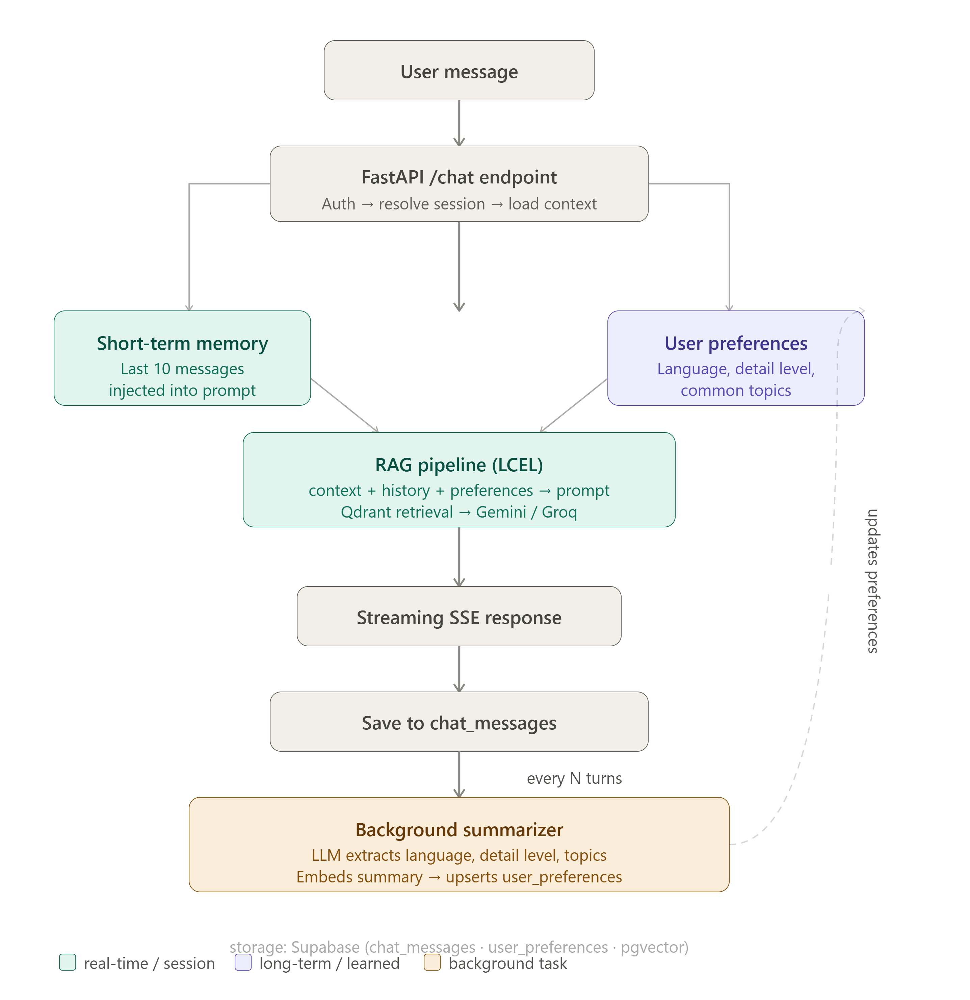

# Student Handbook Assistant

An AI-powered RAG chatbot that answers questions about a student academic handbook - with a three-layer memory architecture that personalizes responses over time.

The project focuses on three kinds of chatbot memory: short-term session history, long-term preference learning, and semantic preference storage with vector embeddings.

## Contents

- [Architecture](#architecture)
- [Tech stack](#tech-stack)
- [Project structure](#project-structure)
- [Setup](#setup)
- [API reference](#api-reference)
- [Future improvements](#future-improvements)

---

## Architecture

The frontend sends authenticated REST requests and receives chat responses over Server-Sent Events (SSE). The backend retrieves relevant handbook content, generates an answer, and updates long-term preferences in the background.

```
Frontend (HTML/CSS/JS)
        │
        │  SSE streaming  /  REST
        ▼
FastAPI Backend
        │
        ├── RAGService          ← LCEL pipeline (retrieval + generation)
        │       ├── EmbeddingService   ← HuggingFace + Qdrant
        │       └── LLMService         ← Gemini (primary) + Groq (fallback)
        │
        ├── DatabaseService     ← Supabase (sessions, messages, preferences)
        └── SummarizerService   ← Background preference extraction
```


### Memory layers

| Layer | Mechanism | Storage |
|---|---|---|
| Short-term | Last 10 messages injected into prompt | Supabase `chat_messages` |
| Long-term | Summarizer extracts preferences every N turns | Supabase `user_preferences` |
| Semantic | Preference summary embedded as a vector | pgvector column |

---

## Tech Stack

**Backend**
- Python 3.10+, FastAPI
- LangChain LCEL pipeline
- `langchain-google-genai` — Gemini 1.5 Flash (primary LLM)
- `langchain-groq` — LLaMA 3.3 70B (automatic fallback)
- `langchain-huggingface` — `sentence-transformers/all-mpnet-base-v2` embeddings
- `langchain-qdrant` — Qdrant Cloud vector store
- Supabase Python client + pgvector
- `python-jose` — JWT authentication
- `bcrypt` — password hashing

**Frontend**
- Plain HTML / CSS / JavaScript — no framework
- Server-Sent Events (SSE) for streaming responses

**Infrastructure**
- Qdrant Cloud — vector database
- Supabase — PostgreSQL + pgvector + Row Level Security

---

## Project structure

```
RAG With Memory/
├── Backend/
│   ├── main.py                      # Standalone placeholder entry point
│   ├── src/
│   │   ├── main.py                  # FastAPI app, /chat SSE endpoint
│   │   ├── dependencies.py          # JWT auth dependency
│   │   ├── routers/
│   │   │   ├── auth.py              # /auth/register, /auth/login, /auth/logout
│   │   │   └── sessions.py          # /sessions, /sessions/{id}/messages
│   │   ├── services/
│   │   │   ├── embeddings.py         # HuggingFace + Qdrant embeddings
│   │   │   ├── llm.py                # Gemini + Groq fallback
│   │   │   ├── rag.py                # Retrieval and generation pipeline
│   │   │   ├── database.py           # Supabase reads/writes
│   │   │   ├── auth.py               # JWT create/verify, password hash
│   │   │   └── summarizer.py         # Background preference extraction
│   │   ├── models/
│   │   │   └── auth.py              # Pydantic schemas
│   │   └── utils/
│   │       ├── config_loader.py      # .env + YAML loading
│   │       └── preference.py         # Preference prompt formatting
│   ├── config/
│   │   ├── db.yaml                  # Database configuration
│   │   ├── llm.yaml                 # LLM provider configuration
│   │   └── memory.yaml              # Memory configuration
│   ├── db_setup/
│   │   └── table_creation.sql       # Supabase schema and helper functions
│   ├── pyproject.toml
│   ├── requirements.txt
│   └── uv.lock
│
└── Frontend/
    ├── index.html                   # Login / register page
    ├── chat.html                    # Main chat interface
    ├── css/
    │   └── style.css
    └── js/
        ├── config.js                # API base URL (swap for prod)
        ├── api.js                   # All fetch/SSE calls, token injection
        ├── auth.js                  # Login/register logic
        ├── sessions.js              # Sidebar session list
        └── chat.js                  # Streaming handler, message rendering
```

---

## Key Design Decisions

**LLM fallback** — `LLMService` tries Gemini on every request. If it raises any exception (rate limit, timeout, server error), it logs a warning and retries with Groq automatically. The user never sees an error.

**Async throughout** — `EmbeddingService.asearch()` uses `QdrantVectorStore.asimilarity_search()`, `LLMService.astream()` uses native async generators. The FastAPI `/chat` endpoint is fully non-blocking — retrieval and generation never block the event loop.

**Background summarizer** — triggered via `asyncio.create_task()` after each response completes. Runs after the SSE stream closes so it never adds latency to the user-facing response. Fires every N messages (default 10), calls the LLM to extract structured preferences as JSON, embeds the summary, and upserts to `user_preferences`.

**Service layer pattern** — each concern is a separate class (`EmbeddingService`, `LLMService`, `RAGService`, `DatabaseService`, `AuthService`, `SummarizerService`). Each is cached as a process-wide singleton via `@lru_cache(maxsize=1)`. Swapping providers (e.g. different embedding model, different vector DB) means changing one service without touching others.

**SSE event structure** — the `/chat` endpoint sends three structured JSON event types:
```
data: {"type": "session", "session_id": "..."}   ← first event, client stores session
data: {"type": "token",   "content": "Based..."}  ← streamed token by token  
data: {"type": "done"}                             ← stream complete
```

---

## Setup

### Prerequisites

- Python 3.10+
- Qdrant Cloud account (free tier)
- Supabase project (free tier)
- HuggingFace account (free inference API)
- Google AI Studio API key (Gemini)
- Groq API key (free tier)

### 1. Clone the repository

```bash
git clone https://github.com/YOUR_USERNAME/rag-handbook-assistant.git
cd rag-handbook-assistant/Backend
```

### 2. Create a virtual environment

```bash
python -m venv .venv
.venv\Scripts\activate        # Windows
source .venv/bin/activate     # macOS/Linux
```

### 3. Install dependencies

```bash
pip install -r requirements.txt
```

### 4. Configure environment variables

Create `Backend/.env`:

```env
# LLM providers
GEMINI_API_KEY=your_gemini_api_key
GROQ_API_KEY=your_groq_api_key

# Embeddings
HF_TOKEN=your_huggingface_token

# Vector store
QDRANT_URL=https://your-cluster.qdrant.io
QDRANT_API_KEY=your_qdrant_api_key

# Database
SUPABASE_URL=https://your-project.supabase.co
SUPABASE_SERVICE_KEY=your_supabase_service_role_key

# Auth
JWT_SECRET=your-strong-secret-key
JWT_ALGORITHM=HS256
JWT_EXPIRY_MINUTES=600
```

### 5. Configure LLM models

Edit `Backend/config/llm.yaml` to set your preferred models:

```yaml
providers:
  primary:
    name: gemini
    model: gemini-1.5-flash
    api_key_env: GEMINI_API_KEY
    timeout: 30
    retries: 1
  fallback:
    name: groq
    model: llama-3.3-70b-versatile
    api_key_env: GROQ_API_KEY
    timeout: 30
    retries: 1

embeddings:
  model: sentence-transformers/all-mpnet-base-v2
```

### 6. Set up the Supabase schema

Run [`Backend/db_setup/table_creation.sql`](Backend/db_setup/table_creation.sql) in your Supabase SQL editor. It creates:
- `users`, `chat_sessions`, `chat_messages`, `user_preferences` tables
- pgvector extension and HNSW index on `preference_vec`
- RLS policies
- Helper RPC functions (`get_recent_messages`, `unsummarized_message_count`)

### 7. Ingest your documents into Qdrant

Add your PDF/text documents to Qdrant under collection name `student_handbook` before running the backend. The embedding service connects to an existing collection — it does not create or populate it.

### 8. Run the backend

```bash
cd Backend
uvicorn src.main:app --reload --port 8000
```

### 9. Run the frontend

```bash
cd Frontend
python -m http.server 5173
```

Open `http://localhost:5173` in your browser.

---

## API Reference

| Method | Endpoint | Auth | Description |
|---|---|---|---|
| POST | `/auth/register` | None | Register new user, returns JWT |
| POST | `/auth/login` | None | Login, returns JWT |
| POST | `/auth/logout` | JWT | Close session, invalidate |
| POST | `/chat` | JWT | SSE streaming chat endpoint |
| GET | `/sessions` | JWT | List user's chat sessions |
| GET | `/sessions/{id}/messages` | JWT | Load session message history |
| DELETE | `/sessions/{id}` | JWT | Delete a session |
| GET | `/health` | None | Health check |

---

## Future Improvements

**Context engineering for better retrieval** - instead of embedding the raw user question, construct a richer context object combining the question, recent chat history, and user preferences before querying the vector store. Better retrieval input means more relevant chunks surface, which directly improves answer quality.

**Async Qdrant client** - switch from `prefer_grpc` sync transport to the native async Qdrant client for fully non-blocking retrieval under high concurrency.

**Preference-based retrieval reranking** - use `preference_vec` similarity to bias retrieval results toward content that matches the user's historical interests.

**Session title generation** - generate session titles via LLM instead of truncating the first question, for more meaningful history display.

---

## License

MIT